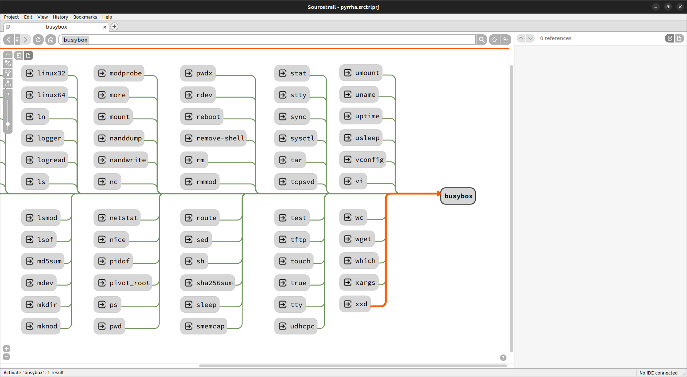

# Pyrrha: A mapper collection for firmware analysis

Pyrrha is a filesystem cartography and correlation software focusing on visualization. It currently focuses on the relationship between executable files but aims at enabling anyone to map and visualize any relationship types. It uses the open-source code source
explorer [Sourcetrail](https://github.com/CoatiSoftware/Sourcetrail) to provide users with an easy way to navigate through and search for 
path to function.


<p align="center">
<b>An example of the symbols and libraries imported by <code>libgcc_s.so.1</code> and of the symbols which reference this library.</b>
</p>


<p align="center">
<b>An example of the symlinks which point on <code>busybox</code>.</b>
</p>


## Installation
The installation is done in two parts:

- Installing `Pyrrha` as a Python module (`pip install pyrrha-mapper`) or using its Docker image.
- Installing `Sourcetrail` to be able to visualize Pyrrha's results. You can use [its last release](https://github.com/CoatiSoftware/Sourcetrail/releases/tag/2021.4.19) and its [documentation](https://github.com/CoatiSoftware/Sourcetrail/blob/master/DOCUMENTATION.md#installation).

## Usage
The usage workflow is composed of two steps which allow you to separate DB creation and result visualization.

1. Run Pyrrha to obtain Sourcetrail compatible files (`*.srctrlprj` for the project file and `*.srctrldb` for the DB file). With the python package, you can just launch the command:
   ```
   $ pyrrha
   Usage: pyrrha [OPTIONS] COMMAND [ARGS]...
   
     Mapper collection for firmware analysis.
   
   Options:
     -h, --help  Show this message and exit.
   
   Commands:
     fs  Map PE and ELF files of a filesystem into a sourcetrail-compatible db.

   ```
   or with the Docker
   ```
   $ docker run  --rm -t -v $PWD:/tmp/pyrrha ghcr.io/quarkslab/pyrrha:latest [OPTIONS] COMMAND [ARGS]...
   ``` 
2. Visualize your results with Sourcetrail
   ```
   $ sourcetrail PROJECT_NAME.srctrlprj
   ```

The detailed documentation of each mapper is available in the [documentation](https://quarkslab.github.io/pyrrha/mappers/mappers/).

## Publications

Pyrrha has been presented at two conferences listed below. These talks include live demo of the `fs` parser which map links between libraries and executables files.

- Pyrrha: navigate easily into your system binaries, *Hack.lu'23*. [[slides]](https://github.com/quarkslab/conf-presentations/blob/master/Confs/HackLu23/pyrrha.pdf) [[video]](https://www.youtube.com/watch?v=-dMl-SvQl4k) 
- Map your Firmware!, *PTS'23*. [[slides]](https://github.com/quarkslab/conf-presentations/blob/master/Confs/PTS23/PTS2023-Talk-14-Pyrrha-map-your-firmware.pdf) [[video]](https://passthesalt.ubicast.tv/videos/2023-map-your-firmware/) 

## Authors
- Eloïse Brocas (@ebrocas), Quarkslab

### Past Contributors
- Pascal Wu (@pwu42), during his internship at Quarkslab