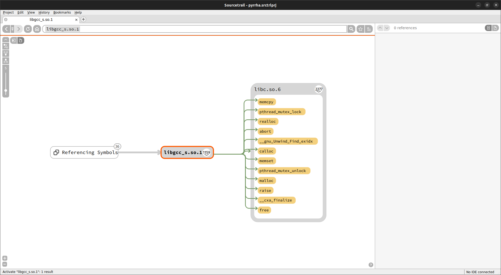
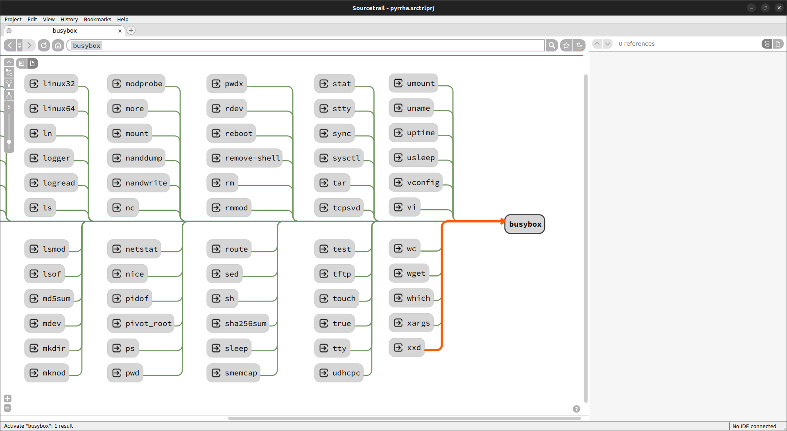
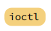
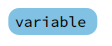
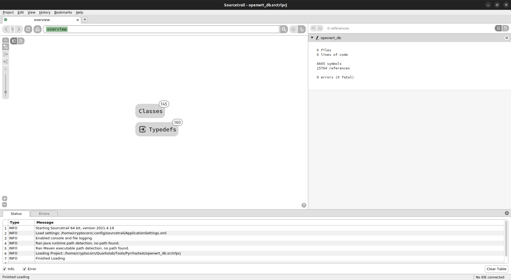

# Pyrrha

* [Introduction](#introduction)
* [Installation](#installation)
* [Usage](#usage)
* [Docker](#docker)
* [Usage Example](#quick-start----usage-example)
* [Authors](#authors)

## Introduction

Pyrrha is a filesystem cartography and correlation software focusing on visualization. It currently focuses on the relationship between executable files but aims at enabling anyone to map and visualize any relationship types. It uses the open-source code source
explorer [Sourcetrail](https://github.com/CoatiSoftware/Sourcetrail) to provide users with an easy way to navigate through and search for 
path to function.


<p align="center">
<b>An example of the symbols and libraries imported by <code>libgcc_s.so.1</code> and of the symbols which reference this library.</b>
</p>


<p align="center">
<b>An example of the symlinks which point on <code>busybox</code>.</b>
</p>


## Installation
The installation is done in two parts:
- installing `Pyrrha` (as a Python module);
- installing `Sourcetrail` to be able to visualize Pyrrha's results.

### Sourcetrail installation
Sourcetrail can be installed using [its last release](https://github.com/CoatiSoftware/Sourcetrail/releases/tag/2021.4.19) and its [documentation](https://github.com/CoatiSoftware/Sourcetrail/blob/master/DOCUMENTATION.md#installation).

### Pyrrha installation
Pyrrha requires a Python version >= 3.10.
It is recommended to install the Python package inside a virtualenv. You can use `pip` to install it.
```python
pip install pyrrha-mapper
```
If you prefer using sources to install Pyrrha, do the following:
```commandline
# Do not forget to activate your virtualenv
$ pip install 'pyrrha @ git+https://github.com/quarkslab/pyrrha'

# If you prefer, you can manually clone the repository and then install the package
$ git clone https://github.com/quarkslab/pyrrha
$ cd pyrrha
$ pip install '.'
```

*Tested for Linux and Windows.* For Windows systems, installation should be run from MSVC Developer shell to build the wheel.

## Docker
`pyrrha` can be used with a docker. It provides Pyrrha but you still need to install Sourcetrail on your system as described in the [Sourcetrail Installation](#sourcetrail-installation) section.

```commandline
$ cd ROOT_DIRECTORY/..
$ docker run  --rm -t -v $PWD:/tmp/pyrrha ghcr.io/quarkslab/pyrrha:latest fs [OPTIONS] ROOT_DIRECTORY
```

A docker image is directly available from our [Github registry](https://github.com/orgs/quarkslab/packages/container/package/pyrrha), but you can also build it from the sources.

```commandline
$ git clone PYRRHA_URL && cd pyrrha
$ docker build -t pyrrha .
```

## Usage
### Mapping with Pyrrha 
First, create your db with `pyrrha`. The `ROOT_DIRECTORY` should contain the whole filesystem you want to map, it should be already extracted or mounted. `ROOT_DIRECTORY` will be considered by Pyrrha as the filesystem root for all the symlink resolutions. 

```commandline
Usage: pyrrha fs [OPTIONS] ROOT_DIRECTORY

  Map a filesystem into a sourcetrail-compatible db.

Options:
  --db PATH   Sourcetrail DB file path (.srctrldb).  [default: pyrrha.srctrldb]
  -e, --json  Create a JSON export of the resulting mapping.
  -h, --help  Show this message and exit.
```

You can also export your Pyrrha results as a JSON file (option `-j`) to be able to postprocess them. For example, you can diff the results between two versions of the same system and list the binaries added/removed and which symbols has been added/removed (*cf* example script in `example`).

## Visualization with Sourcetrail
Open the resulting project with `sourcetrail`. You can now navigate on the resulting cartography. The user interface is described in depth in the [Sourcetrail documentation](https://github.com/CoatiSoftware/Sourcetrail/blob/master/DOCUMENTATION.md#user-interface).

To match the Sourcetrail language, the binaries, the exported functions and symbols, and the symlinks are represented as follows in Sourcetrail.

Binaries |      Exported functions      |      Exported symbols      | Symlinks
:---:|:----------------------------:|:--------------------------:| :---:
 |    |  | 

Do not hesitate to take a look at [Sourcetrail documentation](https://github.com/CoatiSoftware/Sourcetrail/blob/master/DOCUMENTATION.md#graph-view-1) to explore all the possibilities offered by Sourcetrail. [Custom Trails](https://github.com/CoatiSoftware/Sourcetrail/blob/master/DOCUMENTATION.md#custom-trail-dialog) could be really useful in a lot of cases.

## Quick Start—Usage Example
Let's take the example of an OpenWRT firmware which is a common Linux distribution for embedded targets like routers.

First, download the firmware and extract its root-fs into a directory. Here we download the last OpenWRT version for generic x86_64 systems.
```commandline
$ wget https://downloads.openwrt.org/releases/22.03.5/targets/x86/64/openwrt-22.03.5-x86-64-rootfs.tar.gz -O openwrt_rootfs.tar.gz
$ mkdir openwrt_root_fs && cd openwrt_root_fs
$ tar -xf ../openwrt_rootfs.tar.gz
$ cd .. && rm openwrt_rootfs.tar.gz
```

Then we can run Pyrrha on it. It will produce some logs indicating which symlinks or imports cannot be solved directly by the tool. 
*(Do not forget to activate your virtualenv if you have created one for Pyrrha installation.)*
```commandline
$ pyrrha fs --db openwrt_db openwrt_root_fs
$ ls 
openwrt_root_fs openwrt_db.srctrldb  openwrt_db.srctrlprj
```

You can now navigate into the resulting cartography with Sourcetrail.
```commandline
$ sourcetrail openwrt_db.srctrlprj
```


<p align="center">
<b>Pyrrha result opened with Sourcetrail.</b>
</p>

## Authors
- Eloïse Brocas (@ebrocas), Quarkslab
