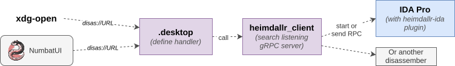

# Disassembler Integration

Some pyrrha mappers and especially the `exe-decomp` enables jumping in a disassembler from the UI
by right-clicking on a function and selecting "Open in disassembler". Executing arbitrary command
is made available by the [Numbat feature](https://quarkslab.github.io/numbat/customization/) and
requires opening a Sourcetrail DB with ``NumbatUI``.

The link between Numbat and a disassembler is made by implementing custom URL protocol handlers. As such,
clicking "Open in disassembler" will trigger a command like:

```bash
xdg-open 'disas://e62f747cf47383858bd563febb813e20?idb=inadyn.i64&offset=0x0124c8'
```

On Linux `xdg-open` will open the URL with the default application associated with the `disas` protocol.
For windows and MacOS, application opened are respectively `start` and `open`. For it to work,
we need to register a custom URL handler for the `disas` protocol. This is done by using [heimdallr](https://github.com/interruptlabs/heimdallr-client) developped by [Interrupt Labs](https://interruptlabs.com/).


## Heimdallr

Heimdallr is a custom URL handler that allows you to open a disassembler from the UI. Developpres provides
an [IDA plugin](https://github.com/interruptlabs/heimdallr-ida) to support it and some folks added a [Ghidra
support](https://github.com/foundryzero/ghidra-deep-links). It works by running a gRPC server in the disassembler
that will listen for incoming requests. The image below summarizes the workflow on Linux:



As shown on the image the Linux system handles URL handlers with `.desktop` files that needs to be registered.
The handler will call `heimdallr_client` utility that is in charge of identifying running gRPC servers to send
the query to a running disassembler or to start it.

## Installation

Heimdallr is fairly unmaintained and undocumented. Still, it works rather well. In order to get it working
one need to perform the following steps:

1. Install `heimdallr-ida` plugin in IDA
2. Install `heimdallr-client` "globally" so that it is reachable by the URL handler dispatcher
3. Configure a `settings.json` file to specify disassembler path etc.
4. Create and register a `.desktop` file to handle the `disas://` protocol.

**1-heimdallr-ida**: The plugin is available on the [Github page](https://github.com/interruptlabs/heimdallr-ida).
The README.md provides installation steps. The ``install()`` command will automatically copy files in the IDA Pro
directory and creates a default `settings.json` file in `$HOME/.config/heimdallr/settings.json`.

!!! tip
    The install command might be a bit buggy, so it is recommended to install the plugin manually by copying the
    files in IDA.

**2-heimdallr-client**: The client is available on the [Github page](https://github.com/interruptlabs/heimdallr-client).
It can be installed with `pip`:

```bash
pip3 install git+https://git@github.com/interruptlabs/heimdallr-client.git#egg=heimdallr_client
```

!!! note
    It should be installed globally so that it is reachable by the URL handler dispatcher. Thus it is recommended 
    to install it with `--user`.

**3-Configuring settings**: The `$HOME/.config/heimdallr` will contain all files used by `heimdallr` to locate
running RPC server instances in order to send them requests. The file `settings.json` is used to configure
the disassembler path and paths where to look for binaries. Thus configure carefully your IDA path inside.

```json
{
    "ida_location": "/my/path/to/ida",
    "idb_path": [
    ],
    "heimdallr_client": "heimdallr_client"
}
```

!!! note
    The IDA location binary provided should be a non-blocking IDA or bash script, as `heimdallr-client`
    will run it with `subprocess.run` and wait for it before sending the request.


**4-Creating protocol handler**: The `.desktop` file is used to register the `disas://` protocol handler.
On Linux, it is usually located in `~/.local/share/applications/`. Creates a file in this directory with
the following content:

???+ "`heimdallr.desktop`"
    ```ini
    [Desktop Entry]
    Name=Heimdallr-handler
    Comment=Disas URL handler
    GenericName=heimdallr-handler-generic
    Exec=heimdallr_client %u
    Type=Application
    StartupNotify=true
    Categories=GNOME;GTK;Utility;
    MimeType=x-scheme-handler/disas;
    ```

Then you need to update the associated `mimeinfo.cache` file with:

```bash
update-desktop-database ~/.local/share/applications
```
This will allow you to handle URLs with the `disas://` scheme.
*It shall add the line: `x-scheme-handler/disas=heimdallr.desktop` in the file.*


## Testing

You can test that URL are properly resolved by running:

```bash
xdg-mime query default x-scheme-handler/disas
```
This should return `heimdallr.desktop`. Then you can try opening a binary with:

```bash
xdg-open 'disas://e62f747cf47383858bd563febb813e20?idb=inadyn.i64&offset=0x0124c8'
```

Where you provide the MD5 hash of the binary, its DB name and the offset to jump to.
By default, heimdallr look in the IDA Pro history to locate the idb. Otherwise, it search
for directories referenced in the "idb_path" field of the `settings.json` file.


## Usage in Pyrrha mappers

Pyrrha uses `heimdallr` to resolve binaries location and offsets. Thus when working
on a specific firmware you might need to specify its root directory in the `ida_path`
of the `settings.json` file. Pyrrha provides an utility command to list, add and remove
entries in this file.

```bash
pyrrha workspace-utils --list  # list all entries
```

```bash
pyrrha workspace-utils --add /path/to/firmware/rootfs  # add directory in search path
```

```bash
pyrrha workspace-utils --delete /path/to/firmware/rootfs  # remove directory from search path
```

