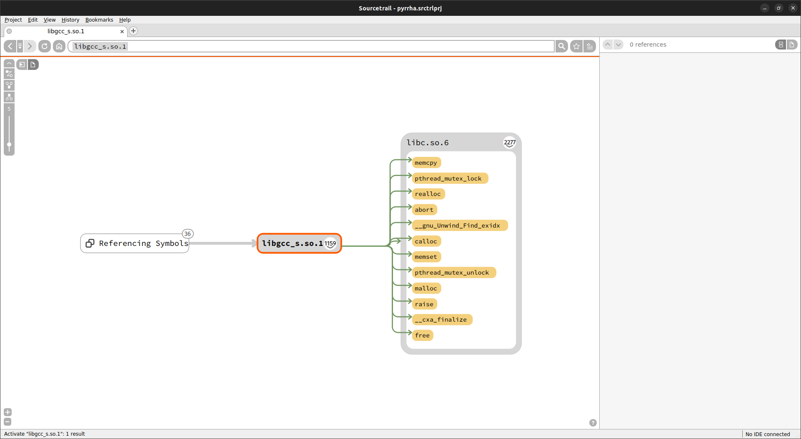
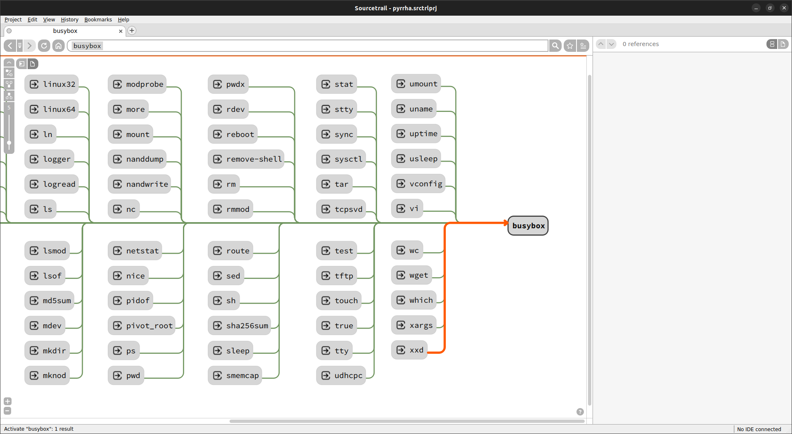
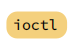
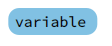
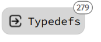
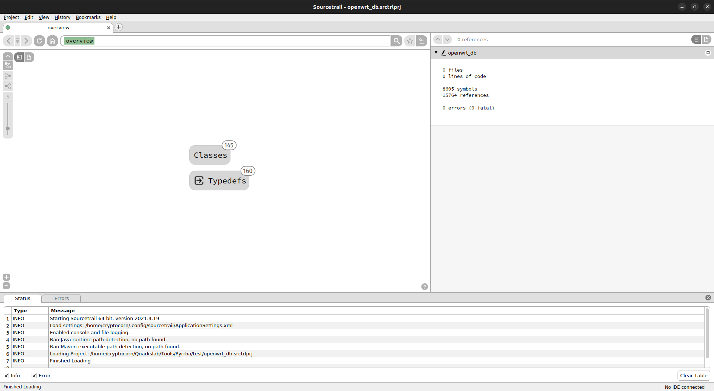

# `fs`: ELF/PE imports/exports and the associated symlinks

!!! example "Demo"
    An live demo of this mapper and how you can use NumbatUI to visualize its results is available [here](https://www.youtube.com/watch?v=-dMl-SvQl4k&t=12m33s).
    
## Usage

### Mapping with Pyrrha 
First, create your db with `pyrrha`. The `ROOT_DIRECTORY` should contain the whole filesystem you want to map, it should be already extracted or mounted. `ROOT_DIRECTORY` will be considered by Pyrrha as the filesystem root for all the symlink resolutions. 

```bash
 Usage: pyrrha fs [OPTIONS] ROOT_DIRECTORY                                                                              
                                                                                                                        
 Map a filesystem into a NumbatUI-compatible db. It maps ELF and PE files, their imports/exports, plus the symlinks     
 that point to these executable files.                                                                                  
                                                                                                                        
╭─ Mapper Options ─────────────────────────────────────────────────────────────────────────────────────────────────────╮
│ --db          PATH            NumbatUI DB file path (.srctrldb). [default: fs.srctrldb]                              │
│ --export  -e                  Create a JSON export of the resulting FileSystem mapping.                              │
│ --jobs    -j  INT [1<=x<=16]  Number of parallel jobs. [default: 1]                                                  │
╰──────────────────────────────────────────────────────────────────────────────────────────────────────────────────────╯
╭─ Resolution ─────────────────────────────────────────────────────────────────────────────────────────────────────────╮
│ When resolving duplicate imports:                                                                                    │
│ --arbitrary    Select the first one available.                                                                       │
│ --interactive  User manually selects which one to use.                                                               │
│ --ignore       Ignore them.                                                                                          │
╰──────────────────────────────────────────────────────────────────────────────────────────────────────────────────────╯
╭─ Options ────────────────────────────────────────────────────────────────────────────────────────────────────────────╮
│ --debug  -d  Set log level to DEBUG.                                                                                 │
│ --help   -h  Show this message and exit.                                                                             │
╰──────────────────────────────────────────────────────────────────────────────────────────────────────────────────────╯
```

You can also export your Pyrrha results as a JSON file (option `-j`) to be able to postprocess them. For example, you can diff the results between two versions of the same system and list the binaries added/removed and which symbols has been added/removed (*cf* example script in `example`).

### Visualization with NumbatUI
Open the resulting project with `numbatui`. You can now navigate on the resulting cartography. The user interface is described in depth in the [NumbatUI documentation](https://github.com/quarkslab/NumbatUI/blob/main/DOCUMENTATION.md#user-interface).

<div class="grid cards" markdown>

-  <center> _Symbols and libraries imported by `libgcc_s.so.1`._</center>

-  <center>_Symlinks pointing on `busybox`._</center>
</div>

Do not hesitate to take a look at [NumbatUI documentation](https://quarkslab.github.io/NumbatUI/interface/) to explore all the possibilities offered by Sourcetrail. [Custom Trails](https://quarkslab.github.io/NumbatUI/interface/#custom-trail) could be really useful in a lot of cases.

!!! info "Sourcetrail Representation"
    If you are visualizing results with Sourcetrail, the exported functions and symbols, and the symlinks are represented as follows:
    
    Binaries |    Exported functions    |     Exported symbols     | Symlinks
    :---:|:------------------------:|:------------------------:| :---:
     |  |  | 

##  Quick Start—Usage Example
Let's take the example of an OpenWRT firmware which is a common Linux distribution for embedded targets like routers.

First, download the firmware and extract its root-fs into a directory. Here we download the last OpenWRT version for generic x86_64 systems.
```commandline
wget https://downloads.openwrt.org/releases/22.03.5/targets/x86/64/openwrt-22.03.5-x86-64-rootfs.tar.gz -O openwrt_rootfs.tar.gz
mkdir openwrt_root_fs && cd openwrt_root_fs
tar -xf ../openwrt_rootfs.tar.gz
cd .. && rm openwrt_rootfs.tar.gz
```

Then we can run Pyrrha on it. It will produce some logs indicating which symlinks or imports cannot be solved directly by the tool. 
*(Do not forget to activate your virtualenv if you have created one for Pyrrha installation.)*
```commandline
pyrrha fs --db openwrt_db openwrt_root_fs -j $(nproc)
```

You can now navigate into the resulting cartography with NumbatUI.
```commandline
numbatUI openwrt_db.srctrlprj
```

<figure markdown>
  
  <figcaption> Pyrrha result opened with NumbatUI.</figcaption>
</figure>


## Postprocessing `fs` result: the diffing example

When you have to compare two bunch of executable files, for example two versions of the same firmware, it could be quickly difficult to determine where to start and have results in a short time. 

Diffing could be a solution. However, as binary diffing can be quite time-consuming, a first approach could be to diff the symbols contained in the binary files to determine which ones were added/removed. For example, using this technics can help you to determines quickly the files that have changed their internal structures versus the files that only contained little update of their dependency. To do that, you can use the JSON export of `fs` parser results.

The following script prints on the standard output the list of files that has been added/removed and then the symbol changes file by file.

???+ abstract "Diffing Pyrrha Exports"

    ``` py 
    --8<-- "diffing_pyrrha_exports.py"
    ```